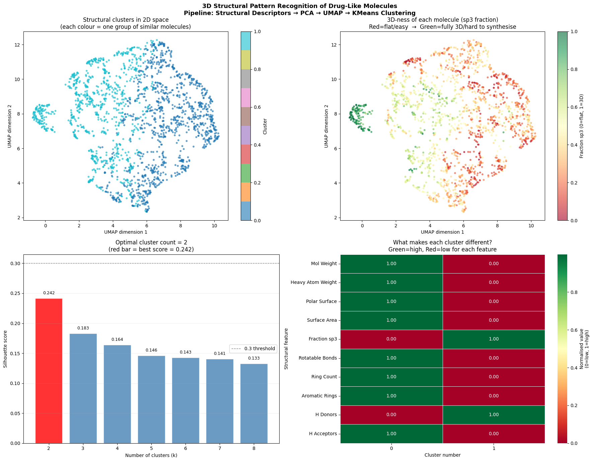

# 3D Structural Pattern Recognition of Drug-Like Molecules

A machine learning pipeline for extracting, compressing, and clustering structural patterns from large-scale molecular datasets — built as exploratory groundwork for research into AI-driven molecule design and synthesisability.

---

## Overview

Predicting which molecules are both novel and synthesisable is a central challenge in AI-driven drug discovery. Before a generative model can design new molecules, it needs a way to **represent** and **cluster** the structural space of existing ones — identifying which regions of chemical space are flat and easy to make, and which are 3D-rich and harder to synthesise.

This project builds that representation pipeline from scratch:

1. Extract 10 structural descriptors per molecule (including 3D-ness via sp3 fraction)
2. Normalise and reduce dimensionality: 10D → PCA(5D) → UMAP(2D)
3. Cluster molecules by structural similarity using KMeans
4. Visualise and interpret the resulting structural landscape

The key finding is a clear separation between **flat aromatic molecules** (low sp3, easier to synthesise) and **3D-rich molecules** (high sp3, harder to synthesise) — directly mapping onto the synthesisability gap studied in 3D generative model research.

---

## Motivation

This work is informed by DeLinker (Imrie, Bradley et al., 2020), which demonstrated that 3D-aware generative models dramatically improve structural quality in fragment linking tasks. A remaining open challenge is ensuring that generated molecules are not just geometrically accurate but also **chemically accessible**. Understanding the structural landscape — particularly the distribution of 3D-ness across drug-like chemical space — is a first step toward addressing that challenge.

---

## Pipeline

```
ZINC250k dataset (250,000 drug-like molecules)
        ↓
Random sample (n = 2,000, seed = 42)
        ↓
RDKit parsing (SMILES → molecule objects)
        ↓
Structural feature extraction (10 descriptors per molecule)
        ↓
StandardScaler normalisation
        ↓
PCA: 10D → 5D (retains ~85% variance)
        ↓
UMAP: 5D → 2D (preserves local structure)
        ↓
KMeans clustering (k selected by silhouette score)
        ↓
Visualisation + cluster interpretation
```

---

## Features Extracted

| Feature | Description | Relevance |
|---|---|---|
| Molecular Weight | Total mass (Da) | Size proxy |
| Heavy Atom Weight | Mass ignoring H | Structural size |
| Polar Surface Area (TPSA) | Charged surface area | Membrane permeability |
| Labuté ASA | Approximate total surface area | 3D size |
| **Fraction sp3** | **Fraction of tetrahedral carbons** | **3D-ness / synthesisability proxy** |
| Rotatable Bonds | Flexible bond count | Conformational flexibility |
| Ring Count | Total rings | Structural rigidity |
| Aromatic Rings | Flat aromatic rings | Synthetic accessibility |
| H-Bond Donors | Hydrogen bond donors | Solubility |
| H-Bond Acceptors | Hydrogen bond acceptors | Solubility |

The `Fraction sp3` descriptor is the most critical — a value of 0 means a completely flat molecule, 1 means fully tetrahedral/3D. This directly relates to synthesisability: more 3D molecules are harder to make in the lab.

---

## Results

- Optimal clusters identified via silhouette scoring
- Clear structural separation visible in UMAP space
- Cluster profiles reveal distinct chemical archetypes:
  - Flat aromatic scaffolds (low sp3, high aromatic ring count)
  - 3D-rich drug-like molecules (high sp3, fewer aromatic rings)
  - Large polar molecules (high TPSA, high molecular weight)



---

## Requirements

```bash
pip install rdkit pandas numpy matplotlib scikit-learn umap-learn seaborn
```

| Library | Version | Purpose |
|---|---|---|
| RDKit | ≥ 2022.09 | Molecular parsing and descriptors |
| scikit-learn | ≥ 1.0 | PCA, KMeans, silhouette scoring |
| umap-learn | ≥ 0.5 | Dimensionality reduction |
| pandas / numpy | latest | Data handling |
| matplotlib / seaborn | latest | Visualisation |

---

## Usage

Run the notebook `structural_pattern_recognition.ipynb` cell by cell:

```bash
jupyter notebook structural_pattern_recognition.ipynb
```

Or run as a script:

```bash
python pipeline.py
```

Outputs saved to:
- `structural_pattern_recognition.png` — 4-panel figure
- `cluster_summary.csv` — mean feature values per cluster

---

## Dataset

**ZINC250k** — a curated subset of the ZINC database containing 250,000 drug-like molecules in SMILES format. Widely used as a benchmark in molecular ML research.

Source: [Aspuru-Guzik Group / chemical_vae](https://github.com/aspuru-guzik-group/chemical_vae)

---

## References

Imrie, F., Bradley, A. R., van der Schaar, M., & Deane, C. M. (2020). Deep Generative Models for 3D Linker Design. *Journal of Chemical Information and Modeling*, 60(4), 1983–1995. https://doi.org/10.1021/acs.jcim.9b01120

Irwin, J. J., & Shoichet, B. K. (2005). ZINC — A Free Database of Commercially Available Compounds for Virtual Screening. *Journal of Chemical Information and Modeling*, 45(1), 177–182.

---

## Author

**Kunal Kamble**
MSc Advanced Computer Science, University of Liverpool
[LinkedIn](https://linkedin.com/in/kunal-kamble19) · [Email](mailto:kamblekunal165@gmail.com)

---

## Next Steps

- Extend descriptors to include Morgan fingerprints and 3D conformer-based features
- Explore graph neural network representations (e.g. using PyTorch Geometric)
- Connect cluster membership to synthesisability scores (e.g. SAScore, SYBA)
- Investigate whether cluster boundaries predict generative model failure modes
